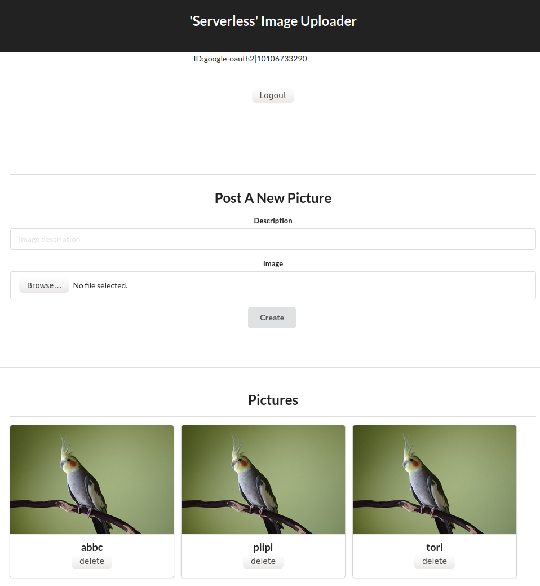

# "Serverless" Personal Picture Storage

This is a sample web app using Serverless application, as the capstone project of Udacity Cloud Developer Nanodegree. 

## Overview of the application

-  This is a web application for personal picture storage, using serverless technologies
-  As a 'serverless' application
    -  this application is deployed by running a configuration file ('serverless.yml') that describes the specification of the services. Therefore no manual cloud settings is required
    - Also, this runs flexibly, meaning that the app only invoked when being requested and stopped after a while. This significantly minimize the operationg costs close to zero during the downtime (except for database and storage costs)
- The functions of the app are as below:  
    1) Users can upload pictures on an cloud storage from the web application
    2) Users can also delete and edit own pictures 
    3) Users can see only own pictures 
    4) All above requires login, and the login requires Google Auth
    5) Logs can be searched by text

## Libraries/services used for this app  

-  "Serverless" framework - overall management of the application and deployment. Using `aws-nodejs-typescript` template
-  AWS services 
    - API Gateway - web routing and Websocket gateway 
    - Lambda - serverless ad-hoc functions   
    - S3   - binary data (image) storage 
    - DynamoDB - NoSQL database
    - Secret Manager - managing secrets
-  Auth0 - Authentication (login)
-  React  - Web frontend
-  NodeJS - for developing the whole project

## How to run
-  install nodeJS 
-  install "Serverless" framework >  `npm install -g serverless` 
-  On AWS setting, go to IAM and create a user with "Programmatic access" access type, with "AdministratorAccess"
-  install dependencies > `npm install` in two folders. `/frontend` and `backend`  
-  Set "Serverless" crednetials > `sls config credentials --provider aws --key (USE YOUR ACCESS KEY) --secret (USE YOUR SECRET KEY) --profile serverless ` 
-  Fill `certdata` in `/backend/src/lambda/auth/rs256Auth0Authorizer.ts` with certification data from Auth0
-  Deploy the application by serverless >  `sls deploy -v`  (this takes several minutes)
-  Go to `/frontend` directory and run the server by `npm start`
-  Access to `localhost:3000`, then you can see the web app 

